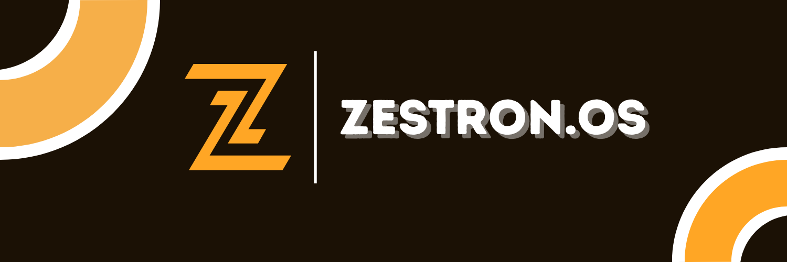

# ZestronOS

## Overview

**ZestronOS** is the first decentralized platform built on Solana dedicated to AI agent creation, deployment, and monetization. It merges low-code development, blockchain security, decentralized compute, and scalable storage into a cohesive Web3 AI ecosystem.



Built around the **MCP architecture**:
- **Model**: Advanced LLMs, graph-based ML models, and reinforcement learning agents.
- **Context**: Real-time aggregation of on-chain and off-chain signals, enabling predictive decision making.
- **Protocol**: Solana smart contracts managing agent lifecycle, licensing, staking, and dynamic state transitions.

## Core Technologies

- **Solana Blockchain**: High throughput (4000+ TPS), parallel transaction execution via Sealevel runtime.
- **Rust / Anchor Framework**: Security-first development with deterministic execution and state constraint validation.
- **Render & Akash**: Federated GPU compute network for agent model inference and periodic fine-tuning.
- **Kafka, Pinecone, The Graph**: High-frequency event streaming, contextual vector search, and decentralized indexing.
- **FHE by Zama**: Data privacy enabling encrypted state computation without disclosure.

Sample smart contract structure:

```rust
#[program]
pub mod agent_factory {
    use super::*;

    pub fn create_agent(ctx: Context<CreateAgent>, config: AgentConfig) -> Result<()> {
        let agent = &mut ctx.accounts.agent;
        agent.owner = ctx.accounts.creator.key();
        agent.config = config;
        Ok(())
    }
}
```

## Architecture Deep Dive

### MCP Model Framework

- **Model Layer**:
  - Inference APIs integrated with Grok 3 and Llama 4 backends.
  - Model hosting redundancy via decentralized providers (Render, Akash).
- **Context Layer**:
  - Solana on-chain data (AMM pools, staking rewards, DAO proposals).
  - Off-chain enriched data feeds (Pyth, Chainlink, X sentiment analysis).
  - On-chain verifiable proofs using Merkle roots.
- **Protocol Layer**:
  - Agent states stored in program-derived accounts (PDAs).
  - Atomic transaction pipelines ensuring idempotent agent action execution.

### Solana-Native Execution

- **Sealevel Concurrency**: Agents execute non-blocking instructions across isolated state accounts.
- **SPL Token Compliance**: Full standardization of payments, staking, and reward flows.
- **Real-Time Oracle Syncing**: Price feeds and off-chain metrics updated every slot.

Example of agent account structure:

```rust
#[account]
pub struct AgentState {
    pub owner: Pubkey,
    pub config_uri: String,
    pub created_at: i64,
    pub is_active: bool,
    pub performance_metrics: Option<AgentPerformance>,
}

#[derive(AnchorSerialize, AnchorDeserialize, Clone)]
pub struct AgentPerformance {
    pub yield_generated: u64,
    pub last_executed_at: i64,
    pub execution_count: u64,
}
```

### Agent Lifecycle

Agents on ZestronOS progress through distinct operational states:
- **Created**: Registered and deployed to Solana with an initial configuration.
- **Licensed**: Available for users to interact with and utilize through staking and payments.
- **Active Execution**: Processing strategies in real-time with updatable performance metrics.
- **Retired**: Deactivated after surpassing lifecycle thresholds or by owner revocation.

Example function to deactivate an agent:

```rust
pub fn deactivate_agent(ctx: Context<DeactivateAgent>) -> Result<()> {
    let agent = &mut ctx.accounts.agent;
    require!(agent.is_active, CustomError::AgentAlreadyInactive);
    agent.is_active = false;
    Ok(())
}
```

Example of agent performance update after each execution cycle:

```rust
pub fn update_performance(ctx: Context<UpdatePerformance>, yield_generated: u64) -> Result<()> {
    let agent = &mut ctx.accounts.agent;
    if let Some(metrics) = &mut agent.performance_metrics {
        metrics.yield_generated += yield_generated;
        metrics.last_executed_at = Clock::get()?.unix_timestamp;
        metrics.execution_count += 1;
    }
    Ok(())
}
```

## System Components

- **Agent Forge**:
  - Dynamic module graph editor.
  - Transactional agent creation pipeline.
- **Marketplace**:
  - Permissionless agent listing.
  - Agent metadata immutably stored on Arweave.
- **Command Deck**:
  - WebSocket-based agent telemetry for real-time operational feedback.
- **Open Vault**:
  - Public template pool with access controlled via Merkle proof-based staking rights.
- **Insight Core**:
  - Agent behavior heatmaps generated via vector analysis and clustering.

### Advanced Staking Mechanics

ZestronOS implements advanced staking options with lock periods to incentivize long-term ecosystem participation.

Example of locked staking function:

```rust
pub fn lock_stake(ctx: Context<LockStake>, amount: u64, lock_period: i64) -> Result<()> {
    let stake = &mut ctx.accounts.user_stake;
    stake.amount += amount;
    stake.lock_until = Clock::get()?.unix_timestamp + lock_period;
    Ok(())
}
```

Locking ensures higher governance weight and template access privileges during the staked period.

## Tokenomics

- **ZEST Token ($ZEST)**:
  - Agent licensing and access control.
  - Staking for governance and premium feature unlocks.
  - Elastic reward distribution based on agent usage telemetry.

Smart contract for staking ZEST:

```rust
pub fn stake_zest(ctx: Context<StakeZest>, amount: u64) -> Result<()> {
    let user_stake = &mut ctx.accounts.user_stake;
    user_stake.amount += amount;
    user_stake.last_staked_at = Clock::get()?.unix_timestamp;
    Ok(())
}
```

Smart contract for agent licensing:

```rust
pub fn license_agent(ctx: Context<LicenseAgent>, amount: u64) -> Result<()> {
    let cpi_ctx = CpiContext::new(
        ctx.accounts.token_program.to_account_info(),
        Transfer {
            from: ctx.accounts.user_zest_account.to_account_info(),
            to: ctx.accounts.treasury_account.to_account_info(),
            authority: ctx.accounts.user.to_account_info(),
        },
    );
    token::transfer(cpi_ctx, amount)?;
    Ok(())
}
```

### Reward Distribution Mechanism

To incentivize top-performing agents and developers, ZestronOS implements reward distribution smart contracts based on agent performance metrics.

```rust
pub fn distribute_rewards(ctx: Context<DistributeRewards>, total_reward: u64) -> Result<()> {
    let developer_share = total_reward * 70 / 100;
    let treasury_share = total_reward - developer_share;

    token::transfer(
        CpiContext::new(
            ctx.accounts.token_program.to_account_info(),
            Transfer {
                from: ctx.accounts.platform_treasury.to_account_info(),
                to: ctx.accounts.developer_account.to_account_info(),
                authority: ctx.accounts.admin.to_account_info(),
            },
        ),
        developer_share,
    )?;
    Ok(())
}
```

## Deployment and Scaling Strategy

- **Kubernetes Autoscaling**:
  - Horizontal Pod Autoscaling (HPA) based on Solana transaction volume.
  - Deployment of inference models across edge nodes for latency optimization.
- **Decentralized Storage**:
  - Arweave: Permanent agent template storage.
  - IPFS: Transient training datasets and vectorized agent states.
- **Cross-Chain Expansion**:
  - Planned integration of Wormhole for Ethereum, Sui, Aptos compatibility.

### Wormhole Bridge and Multi-Chain Design

Future versions of ZestronOS will enable agent cross-chain deployment using Wormhole bridges. Agent metadata, execution proofs, and staking snapshots will be verifiably bridged to external chains.

Diagram:

```plaintext
[Solana Program PDA] -> [Wormhole Bridge] -> [Target Chain PDA Clone]
        |                                 |
   Agent State                    Mirror State + Validator Signatures
```

## Advanced Security Architecture

- **Formal Verification Pipeline**:
  - Smart contract logic validated using Solang static analyzer and property-based fuzzing.
- **Zero-Knowledge Layer**:
  - Planned zkSync and Mina bridge integration for agent proofs.
- **Audit Trails**:
  - Immutable record of agent action executions through Solana’s Ledger and Arweave snapshots.

### Upgradeable Smart Contracts

All core programs are designed to support future upgrades via Solana’s native BPF upgradeable loader.

Example Upgrade Authority Enforcement:

```rust
#[derive(Accounts)]
pub struct UpgradeAgent<'info> {
    #[account(mut, has_one = upgrade_authority)]
    pub agent: Account<'info, AgentState>,
    pub upgrade_authority: Signer<'info>,
}
```

This ensures only the designated authority can perform programmatic upgrades to critical agent logic.

## Conclusion

ZestronOS is designed to operate as a scalable, decentralized AI ecosystem built natively on Solana’s high-performance blockchain. By combining efficient on-chain operations, decentralized compute, cryptographic proofs, modular upgradeable architecture, and privacy-preserving techniques, ZestronOS establishes a new technological standard for autonomous agents in Web3.

For complete SDKs, schema definitions, and contribution guidelines, please consult our upcoming technical portal or reach out via GitHub Discussions.
